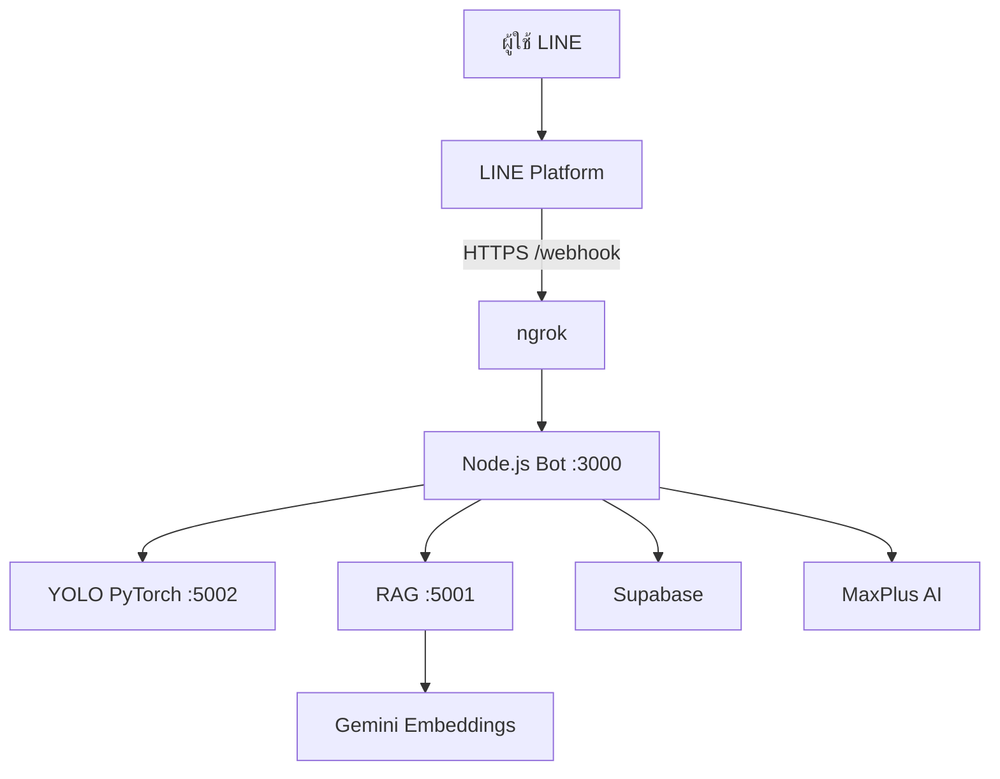

# คู่มือการติดตั้งและใช้งาน Rice Disease Backend

คู่มือนี้อธิบายการนำโปรเจกต์ **LINE Bot “น้องข้าวสวย”** ไปติดตั้งบนเครื่องใหม่ ตั้งค่า LINE Messaging API, Supabase, AI, ngrok และทดสอบระบบตั้งแต่ต้นจนจบ

> คู่มือนี้ตรวจสอบกับโค้ดในสาขา `main` commit `567fb74` วันที่ 17 กันยายน 2026 และกำหนดให้ใช้ `best.pt` กับ `yolo_server.py` เท่านั้น

## สารบัญ

1. [ระบบนี้ทำอะไรได้บ้าง](#1-ระบบนี้ทำอะไรได้บ้าง)
2. [ภาพรวมการทำงาน](#2-ภาพรวมการทำงาน)
3. [สิ่งที่ต้องเตรียม](#3-สิ่งที่ต้องเตรียม)
4. [ดาวน์โหลดโปรเจกต์](#4-ดาวน์โหลดโปรเจกต์)
5. [ติดตั้ง Node.js และ Python](#5-ติดตั้ง-nodejs-และ-python)
6. [ตั้งค่าไฟล์ .env](#6-ตั้งค่าไฟล์-env)
7. [ตั้งค่า Supabase](#7-ตั้งค่า-supabase)
8. [ตั้งค่า LINE Official Account](#8-ตั้งค่า-line-official-account)
9. [ติดตั้งและตั้งค่า ngrok](#9-ติดตั้งและตั้งค่า-ngrok)
10. [เปิดระบบ](#10-เปิดระบบ)
11. [เชื่อม ngrok เข้ากับ LINE](#11-เชื่อม-ngrok-เข้ากับ-line)
12. [ทดสอบระบบ](#12-ทดสอบระบบ)
13. [ตั้งค่า Rich Menu](#13-ตั้งค่า-rich-menu)
14. [สร้างฐานความรู้ RAG ใหม่](#14-สร้างฐานความรู้-rag-ใหม่)
15. [API ที่มีในโปรเจกต์](#15-api-ที่มีในโปรเจกต์)
16. [โรคที่โมเดลรองรับ](#16-โรคที่โมเดลรองรับ)
17. [การแก้ปัญหาที่พบบ่อย](#17-การแก้ปัญหาที่พบบ่อย)
18. [ข้อจำกัดและความปลอดภัย](#18-ข้อจำกัดและความปลอดภัย)
19. [ไฟล์ที่ควรเพิ่มขึ้น GitHub](#19-ไฟล์ที่ควรเพิ่มขึ้น-github)

## 1. ระบบนี้ทำอะไรได้บ้าง

- ผู้ใช้ส่งภาพต้นข้าวหรือใบข้าวผ่าน LINE
- โมเดล YOLO วิเคราะห์โรคและสร้างภาพที่วาดกรอบตำแหน่งโรค
- บอตส่งชื่อโรค ค่าความมั่นใจ และคำแนะนำภาษาไทยกลับไป
- ผู้ใช้พิมพ์คำถามเกี่ยวกับข้าวและสนทนาต่อเนื่องกับบอตได้
- ระบบค้นหาความรู้จาก ChromaDB ด้วย RAG และมีการค้นหาแบบคำสำคัญสำรอง
- ระบบบันทึกผู้ใช้ ประวัติแชท ผลวิเคราะห์ และรูปผลลัพธ์ใน Supabase
- มี REST API สำหรับดูสถิติและประวัติผู้ใช้
- มีสคริปต์สร้างและอัปโหลด Rich Menu ไปยัง LINE

## 2. ภาพรวมการทำงาน



บริการที่ต้องเปิดมีดังนี้

| บริการ | ไฟล์ | พอร์ต | หน้าที่ |
|---|---|---:|---|
| Main Bot | `index.js` | 3000 | รับ LINE Webhook และควบคุมระบบทั้งหมด |
| YOLO Server | `yolo_server.py` | 5002 | วิเคราะห์ภาพด้วย `best.pt` ผ่าน Ultralytics/PyTorch |
| RAG Server | `rag_server.py` | 5001 | ค้นฐานความรู้ใน ChromaDB |
| ngrok | โปรแกรมภายนอก | - | สร้าง HTTPS URL ให้ LINE เรียกเครื่องเราได้ |

> RAG เป็นส่วนเสริม หากไม่เปิด RAG Server ระบบหลักจะย้อนกลับไปค้นหา `data/rice_knowledge.json` แบบคำสำคัญโดยอัตโนมัติ

## 3. สิ่งที่ต้องเตรียม

### โปรแกรม

- Git
- Git LFS หรือ GitHub Release สำหรับแจกไฟล์โมเดล `best.pt`
- Node.js 18 ขึ้นไป แนะนำ Node.js 20 LTS
- Python แนะนำเวอร์ชัน 3.10 หรือ 3.11
- ngrok

### บัญชีและ API

| รายการ | จำเป็นระดับใด | ใช้ทำอะไร |
|---|---|---|
| LINE Official Account + Messaging API | จำเป็น | รับและส่งข้อความผ่าน LINE |
| Supabase | จำเป็นสำหรับฟังก์ชันครบ | เก็บข้อมูลและรูปผลวิเคราะห์ |
| MaxPlus API key | ไม่บังคับ แต่ควรมี | สร้างคำตอบและคำแนะนำด้วย AI |
| Gemini API key | จำเป็นเมื่อเปิด RAG | สร้าง query embedding สำหรับค้น ChromaDB |
| ngrok account | จำเป็นสำหรับรันบนเครื่องตัวเอง | เปิด localhost ให้ LINE เข้าถึงผ่าน HTTPS |

หากไม่มี MaxPlus API key ระบบยังวิเคราะห์รูปได้และใช้คำแนะนำสำรองที่เขียนไว้ในโค้ด แต่คำตอบแชทจะมีความสามารถจำกัด

## 4. ดาวน์โหลดโปรเจกต์

เปิด PowerShell, Command Prompt หรือ Terminal แล้วรัน

```bash
git clone https://github.com/Rawit101/rice_disease_backend.git
cd rice_disease_backend
```

### 4.1 นำไฟล์ `best.pt` มาไว้ในโปรเจกต์

ไฟล์ `best.pt` ต้องอยู่ที่ root ของโปรเจกต์ ระดับเดียวกับ `index.js` และ `yolo_server.py`

```text
rice_disease_backend/
├── best.pt
├── index.js
├── yolo_server.py
└── ...
```


## 5. ติดตั้ง Node.js และ Python

### 5.1 ติดตั้ง Node.js dependencies

```bash
npm ci
```

หาก `npm ci` แจ้งว่า lock file มีปัญหา ค่อยใช้คำสั่งนี้แทน

```bash
npm install
```

### 5.2 สร้าง Python virtual environment

ใช้ `requirements-best-pt.txt` ซึ่งรวม Flask, Ultralytics, PyTorch, ChromaDB และ Google Gen AI สำหรับการรัน `best.pt`

Windows PowerShell:

```powershell
py -3.11 -m venv .venv
.\.venv\Scripts\Activate.ps1
python -m pip install --upgrade pip
pip install -r requirements-best-pt.txt
```

Windows Command Prompt:

```bat
py -3.11 -m venv .venv
.venv\Scripts\activate.bat
python -m pip install --upgrade pip
pip install -r requirements-best-pt.txt
```

macOS/Linux:

```bash
python3.11 -m venv .venv
source .venv/bin/activate
python -m pip install --upgrade pip
pip install -r requirements-best-pt.txt
```

ตรวจสอบว่า Python ใช้จาก virtual environment แล้ว

```bash
python --version
```

หากติดตั้ง PyTorch แล้วมีปัญหาเรื่อง GPU/CUDA ให้ติดตั้งแบบ CPU ก่อน ระบบยังใช้งานได้ แต่อาจวิเคราะห์ช้ากว่า GPU ดูตัวเลือกที่ตรงกับเครื่องได้จาก [PyTorch Get Started](https://pytorch.org/get-started/locally/)

## 6. ตั้งค่าไฟล์ .env

คัดลอกไฟล์ตัวอย่างเป็น `.env`

Windows PowerShell:

```powershell
Copy-Item .env.example .env
```

macOS/Linux:

```bash
cp .env.example .env
```

เปิด `.env` แล้วกรอกค่าจริง

```env
LINE_TOKEN=ใส่_CHANNEL_ACCESS_TOKEN_ของ_LINE
CHANNEL_SECRET=ใส่_CHANNEL_SECRET_ของ_LINE

MAXPLUS_API_KEY=ใส่_MAXPLUS_API_KEY
MAXPLUS_BASE_URL=https://api.maxplus-ai.cc

GEMINI_API_KEY=ใส่_GEMINI_API_KEY

SUPABASE_URL=https://YOUR_PROJECT.supabase.co
SUPABASE_ANON_KEY=ใส่_SUPABASE_ANON_KEY

PORT=3000
YOLO_API_URL=http://127.0.0.1:5002/predict
RAG_API_URL=http://127.0.0.1:5001/search
BASE_URL=
```

รายละเอียดตัวแปร

| ตัวแปร | ตำแหน่งที่นำมาใช้ |
|---|---|
| `LINE_TOKEN` | LINE Developers Console → Messaging API → Channel access token |
| `CHANNEL_SECRET` | LINE Developers Console → Basic settings → Channel secret |
| `MAXPLUS_API_KEY` | ขอจากผู้ให้บริการ MaxPlus AI หรือผู้ดูแลโครงการ |
| `MAXPLUS_BASE_URL` | ปกติใช้ `https://api.maxplus-ai.cc` |
| `GEMINI_API_KEY` | Google AI Studio → Create API key |
| `SUPABASE_URL` | Supabase → Project Settings → API |
| `SUPABASE_ANON_KEY` | Supabase → Project Settings → API |
| `PORT` | พอร์ตของ Main Bot |
| `YOLO_API_URL` | endpoint ของ YOLO Server |
| `RAG_API_URL` | endpoint ของ RAG Server |
| `BASE_URL` | ปล่อยว่างได้ ระบบจะตรวจ URL จาก ngrok request |

โค้ดยังรองรับชื่อตัวแปร `CHANNEL_ACCESS_TOKEN` แทน `LINE_TOKEN` แต่ควรกรอกเพียงชื่อเดียวเพื่อไม่ให้สับสน

> ห้ามนำ `.env`, Channel access token, Channel secret หรือ API key ขึ้น GitHub

## 7. ตั้งค่า Supabase

Supabase ใช้เก็บ 3 ตาราง ได้แก่ `users`, `analyses`, `chat_history` และเก็บภาพผลวิเคราะห์ใน Storage

### 7.1 สร้างตารางและฟังก์ชัน

1. สร้างโปรเจกต์ใน Supabase
2. เปิด **SQL Editor**
3. เปิดไฟล์ `scripts/supabase-init.sql` ในโปรเจกต์
4. คัดลอก SQL ทั้งหมดไปวาง แล้วกด **Run**
5. ตรวจสอบใน **Table Editor** ว่ามีตาราง `users`, `analyses` และ `chat_history`

### 7.2 สร้าง Storage bucket

1. เปิด **Storage**
2. กด **New bucket**
3. ตั้งชื่อให้ตรงทุกตัวว่า `rice-disease-analysis-results`
4. เลือก Private bucket ได้ เพราะโค้ดสร้าง Signed URL ให้ LINE
5. ตั้ง file size limit อย่างน้อย 10 MB และอนุญาต `image/jpeg` หากมีตัวเลือกชนิดไฟล์

### 7.3 เพิ่ม Storage policies สำหรับโค้ดรุ่นปัจจุบัน

Storage ของ Supabase ไม่อนุญาตให้อัปโหลดจนกว่าจะมี RLS policy ให้เปิด SQL Editor แล้วรัน

```sql
create policy "Allow bot to upload result images"
on storage.objects
for insert
to anon
with check (
  bucket_id = 'rice-disease-analysis-results'
  and (storage.foldername(name))[1] = 'results'
);

create policy "Allow bot to read result images"
on storage.objects
for select
to anon
using (
  bucket_id = 'rice-disease-analysis-results'
  and (storage.foldername(name))[1] = 'results'
);
```

นโยบายนี้ทำให้โค้ดปัจจุบันที่ใช้ `SUPABASE_ANON_KEY` อัปโหลดและสร้าง Signed URL ได้ เหมาะกับโปรเจกต์สาธิตหรือการศึกษา สำหรับ production ควรเปลี่ยน backend ไปใช้ service role key ฝั่งเซิร์ฟเวอร์และออกแบบ RLS ให้รัดกุมกว่าเดิม โดยห้ามเปิดเผย service role key ต่อสาธารณะ

## 8. ตั้งค่า LINE Official Account

1. สร้าง LINE Official Account หรือเลือกบัญชีที่มีอยู่
2. เปิดใช้ Messaging API แล้วเข้า [LINE Developers Console](https://developers.line.biz/console/)
3. เลือก Provider และ Messaging API channel ของบอต
4. ที่แท็บ **Basic settings** คัดลอก **Channel secret** ไปใส่ `CHANNEL_SECRET`
5. ที่แท็บ **Messaging API** ออก Channel access token แล้วคัดลอกไปใส่ `LINE_TOKEN`
6. สแกน QR code ในแท็บ Messaging API เพื่อเพิ่มบอตเป็นเพื่อน
7. ไปที่ LINE Official Account Manager แล้วปิด **Auto-reply messages** เพื่อไม่ให้ข้อความอัตโนมัติของ LINE ตอบซ้ำกับบอต
8. ยังไม่ต้องกรอก Webhook URL จนกว่าจะเปิด Main Bot และ ngrok ในขั้นตอนถัดไป

LINE กำหนดให้ Webhook URL เป็น HTTPS และให้ตั้ง URL จากแท็บ Messaging API จากนั้นกด Verify และเปิด **Use webhook** ดูรายละเอียดได้ที่ [LINE Developers: Build a bot](https://developers.line.biz/en/docs/messaging-api/building-bot/)

## 9. ติดตั้งและตั้งค่า ngrok

### 9.1 ติดตั้ง

Windows:

```powershell
winget install ngrok.ngrok
```

macOS:

```bash
brew install ngrok
```

หรือดาวน์โหลดจาก [ngrok Download](https://ngrok.com/download)

### 9.2 เชื่อมบัญชี ngrok

สมัครและคัดลอก authtoken จาก ngrok Dashboard แล้วรันเพียงครั้งแรก

```bash
ngrok config add-authtoken YOUR_NGROK_AUTHTOKEN
```

ngrok ใช้สำหรับนำ localhost ออกเป็น public HTTPS URL ดูแนวทางล่าสุดได้ที่ [ngrok: Get started](https://ngrok.com/docs/start)

## 10. เปิดระบบ

ให้เปิด Terminal แยก 4 หน้าต่าง และรันจากโฟลเดอร์ `rice_disease_backend`

### Terminal 1 — YOLO Server (`best.pt`)

Windows PowerShell:

```powershell
.\.venv\Scripts\Activate.ps1
python yolo_server.py
```

macOS/Linux:

```bash
source .venv/bin/activate
python yolo_server.py
```

ค่าเริ่มต้นคือ `http://127.0.0.1:5002` และเมื่อเปิดสำเร็จต้องเห็น `Model loaded: True`

### Terminal 2 — RAG Server

Windows PowerShell:

```powershell
.\.venv\Scripts\Activate.ps1
python rag_server.py
```

macOS/Linux:

```bash
source .venv/bin/activate
python rag_server.py
```

ค่าเริ่มต้นคือ `http://127.0.0.1:5001` และต้องมี `GEMINI_API_KEY`

หากยังไม่มี Gemini API key ให้ข้าม Terminal 2 ได้ ระบบ Main Bot จะใช้ keyword search จากไฟล์ JSON แทน

### Terminal 3 — Main Bot

```bash
npm start
```

เมื่อสำเร็จควรเห็นข้อความใกล้เคียงกับ

```text
Webhook running on port 3000
YOLO API URL: http://127.0.0.1:5002/predict
```

### Terminal 4 — ngrok

```bash
ngrok http 3000
```

คัดลอก HTTPS URL ที่แสดงในบรรทัด Forwarding เช่น

```text
https://example-name.ngrok-free.app
```

ห้ามปิด Terminal ทั้ง 4 ระหว่างทดสอบ

## 11. เชื่อม ngrok เข้ากับ LINE

1. นำ HTTPS URL ของ ngrok มาต่อท้ายด้วย `/webhook`

   ```text
   https://example-name.ngrok-free.app/webhook
   ```

2. เข้า LINE Developers Console → Messaging API → Webhook URL
3. กด **Edit** วาง URL แล้วกด **Update**
4. กด **Verify** ต้องขึ้น `Success`
5. เปิด **Use webhook**

บัญชี ngrok แบบ URL ชั่วคราวอาจได้ URL ใหม่เมื่อปิดแล้วเปิด ngrok อีกครั้ง หาก URL เปลี่ยน ต้องกลับมาอัปเดต Webhook URL ใน LINE ทุกครั้ง

สามารถดู request ที่วิ่งผ่าน ngrok ได้ที่ `http://127.0.0.1:4040`

## 12. ทดสอบระบบ

### 12.1 ทดสอบบริการบนเครื่อง

เปิด URL ต่อไปนี้ใน Browser

- Main Bot: `http://127.0.0.1:3000/`
- YOLO health: `http://127.0.0.1:5002/health`
- YOLO classes: `http://127.0.0.1:5002/classes`
- RAG health: `http://127.0.0.1:5001/health`
- RAG stats: `http://127.0.0.1:5001/stats`

ผลที่ถูกต้องของ Main Bot คือ

```text
LINE Bot is running! ✅
```

### 12.2 ทดสอบโมเดล YOLO โดยไม่ผ่าน LINE

Windows PowerShell:

```powershell
curl.exe -X POST -F "image=@test_model/test1.jpg" http://127.0.0.1:5002/predict
```

macOS/Linux:

```bash
curl -X POST -F "image=@test_model/test1.jpg" http://127.0.0.1:5002/predict
```

ผลลัพธ์ควรมี `"success": true`, รายการ `predictions` และ `annotated_image`

### 12.3 ทดสอบ RAG

Windows PowerShell:

```powershell
Invoke-RestMethod `
  -Uri "http://127.0.0.1:5001/search" `
  -Method Post `
  -ContentType "application/json" `
  -Body '{"question":"โรคไหม้มีอาการอย่างไร","top_k":3}'
```

macOS/Linux:

```bash
curl -X POST http://127.0.0.1:5001/search \
  -H "Content-Type: application/json" \
  -d '{"question":"โรคไหม้มีอาการอย่างไร","top_k":3}'
```

### 12.4 ทดสอบผ่าน LINE

1. ส่งข้อความ `สวัสดี` บอตควรตอบข้อความต้อนรับ
2. ถาม `โรคไหม้มีอาการอย่างไร` บอตควรตอบเฉพาะเรื่องข้าวเป็นภาษาไทย
3. ส่งภาพใบข้าวที่ชัด เห็นอาการใกล้ ๆ และมีแสงเพียงพอ
4. บอตควรตอบทันทีว่าได้รับรูปและกำลังวิเคราะห์
5. หลังประมวลผล บอตควรส่งภาพที่วาดกรอบ พร้อมชื่อโรค ความมั่นใจ และคำแนะนำ
6. ถามต่อว่า `ควรใช้ยาอะไร` บอตควรอ้างอิงผลวิเคราะห์ล่าสุดใน session

## 13. ตั้งค่า Rich Menu

ใน repository มี `menu1.png`, `menu2.png` และ `richmenu.jpg` แล้ว รูปปัจจุบันมีขนาด 2500 × 843 พิกเซล และแบ่งเป็น 2 ปุ่ม

| พื้นที่ | การทำงาน |
|---|---|
| ซ้าย | เปิดหน้าต่างเลือกรูปภาพใน LINE |
| ขวา | เปิดเว็บไซต์กรมการข้าว |

หากแก้รูป `menu1` หรือ `menu2` ให้รวมรูปใหม่ก่อน

```bash
python combine_richmenu.py
```

จากนั้นอัปโหลดและตั้งเป็น Rich Menu เริ่มต้น

```bash
node setup-richmenu.js
```

> คำเตือน: `setup-richmenu.js` รุ่นปัจจุบันจะลบ Rich Menu เดิมทั้งหมดใน LINE channel ก่อนสร้างอันใหม่ อย่ารันกับ channel ที่มีเมนูสำคัญโดยไม่ได้สำรองข้อมูลหรือแก้สคริปต์ก่อน

## 14. สร้างฐานความรู้ RAG ใหม่

repository มี `data/rice_knowledge.json` และ `chroma_db/` ที่สร้างไว้แล้ว จึงไม่จำเป็นต้องสร้างใหม่เพื่อเริ่มใช้งาน

หากต้องการดึงข้อมูลล่าสุดจาก Rice Knowledge Bank และสร้าง embeddings ใหม่ ให้เปิด virtual environment และรัน

```bash
npm run build:knowledge
python scripts/build_rag.py
```

สิ่งที่ต้องมี

- อินเทอร์เน็ต
- `GEMINI_API_KEY` ที่ใช้งานได้
- Python packages จาก `requirements-best-pt.txt`

> `scripts/build_rag.py` จะลบ collection `rice_diseases` เดิมแล้วสร้างใหม่ ควรสำรอง `chroma_db/` ก่อนหากต้องการเก็บรุ่นเดิม

## 15. API ที่มีในโปรเจกต์

### Main Bot — port 3000

| Method | Path | หน้าที่ |
|---|---|---|
| GET | `/` | ตรวจสอบว่า Main Bot ทำงาน |
| POST | `/webhook` | รับ event จาก LINE |
| GET | `/api/stats` | ดูสถิติรวมจาก Supabase |
| GET | `/api/users/:userId/history` | ดูประวัติของ LINE user |

### YOLO (`best.pt`) — port 5002

| Method | Path | หน้าที่ |
|---|---|---|
| GET | `/` | สถานะโมเดลและรายชื่อคลาส |
| GET | `/health` | ตรวจสุขภาพบริการ |
| GET | `/classes` | ดูคลาสที่โมเดลรองรับ |
| POST | `/predict` | ส่งรูปแบบ multipart/form-data โดยใช้ key `image` |

### RAG — port 5001

| Method | Path | หน้าที่ |
|---|---|---|
| GET | `/health` | ตรวจสุขภาพและจำนวน chunks |
| GET | `/stats` | ดูสถิติฐานความรู้ |
| POST | `/search` | ค้น context ที่เกี่ยวข้อง |
| POST | `/query` | ค้น context และสร้างคำตอบผ่าน MaxPlus |

## 16. โรคที่โมเดลรองรับ

จากรายชื่อคลาสที่โค้ด `index.js` รองรับสำหรับ `best.pt` รุ่นปัจจุบัน มี 9 คลาสหลัก

| Class | ชื่อที่บอตแสดง |
|---|---|
| `Bacterial_Blight` | โรคขอบใบแห้ง |
| `Brown_Spot` | โรคใบจุดสีน้ำตาล |
| `Rice_Blast` | โรคไหม้ |
| `Narrow_Brown_Spot` | โรคใบขีดสีน้ำตาล |
| `False_Smut` | โรคดอกกระถิน |
| `Dirty_Seed` | โรคเมล็ดด่าง |
| `Sheath_Rot` | โรคกาบใบเน่า |
| `Stem_Rot` | โรคลำต้นเน่า |
| `Red_Stripe` | โรคใบแถบแดง |

โมเดลรุ่นนี้ไม่มีคลาส `healthy` หากไม่พบ detection ระบบจะตอบว่าไม่พบโรคที่โมเดลรู้จักหรือภาพอาจไม่ชัด

## 17. การแก้ปัญหาที่พบบ่อย

| อาการ | สาเหตุที่เป็นไปได้ | วิธีแก้ |
|---|---|---|
| `best.pt` หาไม่พบ | โมเดลไม่ได้อยู่ใน GitHub หรือวางผิดตำแหน่ง | ดาวน์โหลด `best.pt` แล้ววางไว้ที่ root ระดับเดียวกับ `yolo_server.py` |
| `No module named ultralytics` หรือ `torch` | Python dependencies ยังไม่ครบ | เปิด `.venv` แล้วรัน `pip install -r requirements-best-pt.txt` |
| `Model loaded: False` | `best.pt` เสีย ไม่ครบ หรือ format ไม่ตรง | ตรวจขนาดไฟล์ ดาวน์โหลดใหม่ และลอง `python -c "from ultralytics import YOLO; YOLO('best.pt')"` |
| Main Bot แจ้ง `LINE_TOKEN not found` | ไม่มี `.env` หรือชื่อตัวแปรผิด | สร้าง `.env` ที่ root และกรอก `LINE_TOKEN` |
| LINE Verify ขึ้น Failed | Main Bot/ngrok ไม่ทำงาน หรือ URL ผิด | ตรวจ `npm start`, `ngrok http 3000` และ URL ต้องลงท้าย `/webhook` |
| LINE ตอบ 403 | `CHANNEL_SECRET` ไม่ตรง | คัดลอก Channel secret ใหม่และอย่าให้มีช่องว่างเกิน |
| LINE ตอบข้อความซ้ำ | Auto-reply ของ LINE ยังเปิด | ปิด Auto-reply ใน LINE Official Account Manager |
| ngrok แจ้ง `ERR_NGROK_8012` | ไม่มีบริการที่พอร์ต 3000 | เปิด `npm start` และตรวจว่า `PORT=3000` |
| เปลี่ยนวันแล้ว LINE ใช้ไม่ได้ | ngrok URL เปลี่ยนหลังเปิดใหม่ | นำ URL ใหม่ไปอัปเดต Webhook URL แล้ว Verify อีกครั้ง |
| YOLO ใช้ได้ แต่ LINE ไม่ส่งภาพผลลัพธ์ | Supabase bucket/policy ไม่ครบ | ตรวจชื่อ bucket และ Storage `INSERT`/`SELECT` policies |
| `relation users does not exist` | ยังไม่ได้สร้างตาราง | รัน `scripts/supabase-init.sql` ใน Supabase SQL Editor |
| RAG เปิดไม่ได้เพราะ `GEMINI_API_KEY` | ไม่มีหรือ key ใช้ไม่ได้ | กรอก key ใหม่ หรือข้าม RAG Server เพื่อใช้ keyword fallback |
| `ChromaDB collection not found` | `chroma_db/` ไม่ครบ | ดึง repository ใหม่หรือรัน `python scripts/build_rag.py` |
| แชทขึ้น `All AI models failed` | MaxPlus key, quota หรือชื่อโมเดลมีปัญหา | ตรวจ `MAXPLUS_API_KEY`, endpoint และบัญชีผู้ให้บริการ ระบบจะใช้คำตอบสำรองเมื่อทำได้ |
| พอร์ตถูกใช้งานอยู่ | มีโปรแกรมเดิมเปิดพอร์ต 3000/5001/5002 | ปิด process เดิม หรือเปลี่ยนพอร์ตและแก้ URL ให้ตรงกัน |
| PowerShell ไม่ยอมรัน Activate.ps1 | Execution policy ของ Windows | ใช้ Command Prompt กับ `activate.bat` หรืออนุญาตเฉพาะ process ปัจจุบัน |

## 18. ข้อจำกัดและความปลอดภัย

- ค่า “ความรุนแรง” ใน `index.js` รุ่นปัจจุบันคำนวณจาก confidence ของโมเดล ไม่ได้คำนวณจากพื้นที่แผล จึงควรเรียกว่า “ระดับความมั่นใจ” หรือปรับอัลกอริทึมก่อนใช้เป็นความรุนแรงจริง
- ผลวิเคราะห์เป็นเครื่องมือช่วยคัดกรอง ไม่ควรใช้แทนคำวินิจฉัยของเจ้าหน้าที่เกษตรหรือนักโรคพืช
- ngrok ทำให้ endpoint บนเครื่องเข้าถึงจากอินเทอร์เน็ตได้ ให้เปิดเฉพาะเวลาทดสอบ
- อย่า commit `.env`, API key, Channel token, Channel secret หรือ Supabase service role key
- หาก key รั่ว ให้ revoke/rotate key ทันที
- `/api/stats` และ `/api/users/:userId/history` ยังไม่มีระบบล็อกอิน ไม่ควรเปิดเป็น public production โดยไม่เพิ่ม authentication
- Storage policies ตัวอย่างรองรับโค้ดปัจจุบันสำหรับการสาธิต ควรเพิ่มการจำกัดสิทธิ์ก่อน production
- การ deploy ผ่าน `hf-space/` หรือ `render-api/` ต้องคัดลอก `best.pt` เข้า build context ด้วย มิฉะนั้นบริการจะเปิดได้แต่โมเดลจะโหลดไม่สำเร็จ

## 19. ไฟล์ที่ควรเพิ่มขึ้น GitHub

หลังนำไฟล์จากชุดคู่มือนี้ไปวางที่ root ของโปรเจกต์ ให้ตรวจสอบและ commit

```bash
git status
git add HOW_TO_USE.md .env.example requirements-best-pt.txt
git commit -m "Add complete best.pt setup guide"
git push
```

แนะนำให้เพิ่มลิงก์นี้ไว้ช่วงต้นของ `README.md`

```markdown
## คู่มือใช้งาน

ดูขั้นตอนติดตั้ง LINE, Supabase, ngrok และการเปิดระบบทั้งหมดได้ที่ [HOW_TO_USE.md](HOW_TO_USE.md)
```

## แหล่งอ้างอิงการตั้งค่าภายนอก

- [LINE Developers — Build a bot](https://developers.line.biz/en/docs/messaging-api/building-bot/)
- [ngrok — Get started](https://ngrok.com/docs/start)
- [Supabase — Storage Access Control](https://supabase.com/docs/guides/storage/security/access-control)
- [Git LFS — Getting Started](https://git-lfs.com/)
อ
